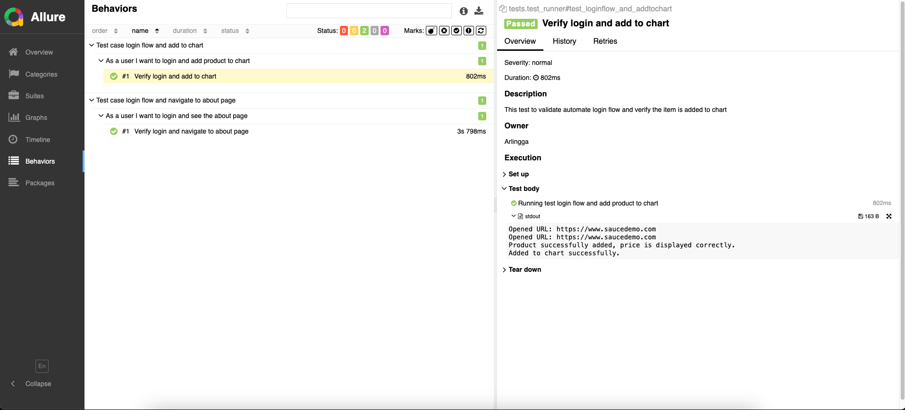

# Amartha Tech Assignment

This project contains automated tests for technical test as Senior QA Engineer position at Amartha.

## Table of Contents

- [Prerequisites](#prerequisites)
- [Installation](#installation)
- [Running Tests](#running-tests)
- [Viewing Allure Reports](#viewing-allure-reports)
- [Tech Stack](#tech-stack)

## Prerequisites

Before you begin, ensure you have the following installed on your system:

- Python 3.x
- pip (Python package installer)
- [Java JDK](https://www.oracle.com/java/technologies/javase-jdk11-downloads.html) (required for Allure)

## Installation
### Install Allure
#### Install Allure Report for Windows
Allure Report can be installed on Windows from the Scoop package repository.

Install from Scoop
- Make sure Scoop is installed. See the [installation instructions on Github](https://github.com/ScoopInstaller/Install#readme).
- Make sure Java version 8 or above installed, and its directory is specified in the JAVA_HOME environment variable.

In a terminal, run this command:
```bash
    scoop install allure
```
Run this command to see if it reports the latest version:
```
    allure --version
```
---
#### Install Allure Report for macOS and Linux
Install from Homebrew
- Make sure Homebrew is installed.
- In a terminal, run this command:
```
    brew install allure
```
- Run this command to see if it reports the latest version:
```
    allure --version
```
---
#### Create virtual environment
- It is recommended to create a virtual environment to manage dependencies.
- Go to project directory folder then running this command:
```
    python3 -m venv .venv
    source venv/bin/activate  # On macOS/Linux
    -------------------------------------------
    python -m venv venv
    venv\Scripts\activate  # On Windows
```

---
#### Install dependecies using pip

- Install dependecies from requirements.txt
- Selenium and Pytest can be installed from requirements.txt
```
    selenium==4.25.0
    pytest==8.3.3
    allure-pytest==2.13.5
    allure-python-commons~=2.13.5
```
then run
```bash
    pip install -r requirements.txt
```
    
## Running tests

Running the test_runner.py file on local.
- Headless = true (by default)
```bash
    pytest --alluredir=reports/allure
```
- Headless = false
```
    HEADLESS=false pytest --alluredir=reports/allure
```


## Viewing Allure Reports

When running test_runner.py with above command, it will automatically generate test report in folders reports/allure, to see the report you can run allure dashboard from localhost with this command:
```
    allure serve reports/allure
```
Here the example of allure test result.



You can see overview result and you can check the test results on suites tab or BDD result on Behaviours.

## Tech Stack

**IDE:** Pycharm

**Language:** Python

**Framework:** Selenium, Pytest

**Reporting:** Allure

